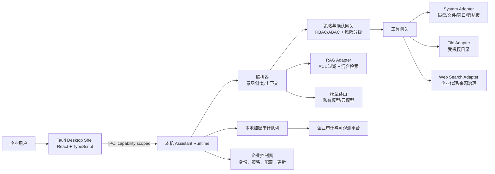

# 企业级桌面智能助手技术方案（V1.0）

> 目标：将当前的 RAG Pet 原型演进为 Windows 优先、可控且可审计的桌面 AI 助手。它能理解自然语言，并在用户授权范围内查询本机信息、定位和打开文件、检索企业知识、联网搜索，以及在明确确认后执行受控操作。

## 1. 产品边界与原则

### 1.1 首期能力

| 场景 | 用户示例 | 执行策略 |
| --- | --- | --- |
| 系统信息 | “C 盘还剩多少空间？” | 只读，无需二次确认 |
| 文件定位 | “桌面上的合同在哪？” | 只读搜索，返回完整路径和候选项 |
| 文件打开 | “打开刚才的合同” | 显示目标与默认应用，用户确认后打开 |
| 企业知识 | “报销标准是什么？” | 按数据权限检索，返回来源和版本 |
| 联网检索 | “搜索今天的行业新闻” | 明示联网、展示来源和检索时间 |
| 文件写入/删除 | “把结果保存到桌面”“清理下载目录” | 生成执行预览；写入、移动、删除均需明确确认 |

### 1.2 非目标（MVP 不做）

- 不提供任意 Shell/PowerShell/注册表执行能力。
- 不以管理员权限运行；需要提权的操作转交 Windows UAC 和独立受控组件。
- 不进行无提示的批量删除、外发文件、安装软件、修改安全策略。
- 不把用户桌面、剪贴板或企业文档默认上传给模型服务。

### 1.3 设计原则

1. **最小权限**：模型从不直接拥有操作系统权限。
2. **读写分级**：只读可自动执行；有副作用的动作必须确认；高风险动作必须强确认或审批。
3. **策略优先于提示词**：权限、路径、数据脱敏与审批都由确定性策略引擎决定，不能依赖 LLM “自觉”。
4. **本地优先、云端可选**：敏感上下文默认留在终端；企业可选择私有部署模型和检索服务。
5. **全链路可追溯**：每次工具调用均具备请求、授权、输入摘要、结果摘要、操作者和关联会话审计记录。

## 2. 当前项目评估

当前代码已提供可复用的原型底座：Tauri 2 桌面窗口、TypeScript/Hono 对话服务、OpenAI 兼容模型调用、RAG、SSE、文件浏览、磁盘空间、剪贴板和网页搜索工具。`disk_usage`、`list_files`、`find_files` 已可覆盖“查看 C 盘空间”和“查找桌面文件”等只读需求。

但它尚不满足企业发布条件，主要差距如下：

| 领域 | 现状 | 企业化改造要求 |
| --- | --- | --- |
| 工具执行 | 工具直接由 Node 进程执行；读写删除与打开没有统一审批流程 | 建立工具网关、风险分级、确认令牌、策略判定与审计 |
| API 暴露 | 本地 HTTP 服务使用全量 CORS；接口没有会话鉴权 | 仅监听 `127.0.0.1`，随机本地令牌、严格 Origin/CSP、请求限流 |
| 权限模型 | 路径白名单与关键目录黑名单混用，缺少租户/用户/角色概念 | 用户授权目录 + 企业策略 + RBAC/ABAC 三层授权 |
| 密钥与数据 | API Key 写入普通 JSON 配置文件 | Windows Credential Manager/企业密钥托管；加密数据和密钥轮换 |
| RAG | 内存 BM25 + 本地持久化，未提供访问控制、版本与溯源 | 混合检索、文档 ACL、元数据过滤、索引任务和数据生命周期 |
| 交付运维 | Tauri 主进程通过 `npx tsx src/server.ts` 启动服务 | 将 sidecar 编译并签名；自动更新、软件清单、灰度与回滚 |
| 可观测性 | 仅本地日志 | OpenTelemetry、结构化审计、指标、告警和 SIEM 对接 |
| 稳定性 | 当前源文件和文档存在字符编码异常风险 | 统一 UTF-8、CI 编码检测、发布前质量门禁 |

结论：保留 Tauri + TypeScript 前端资产和现有 RAG 交互；将执行能力从 `src/tools.ts` 逐步迁出为受控的本机 Agent 服务。不要在现有 Node 工具层继续堆叠高权限能力。

## 3. 推荐总体架构



### 3.1 部署形态

- **终端数据面（必须）**：Tauri UI、Assistant Runtime、系统/文件工具适配器、本地加密缓存、审计队列。用户操作只能在这里执行。
- **企业控制面（推荐）**：身份联合登录、设备注册、策略下发、模型路由、知识库索引、集中审计、版本发布。
- **云端模型（可选）**：只收到策略允许且脱敏后的最小上下文。对于涉密客户，改接 VPC/本地部署模型。

### 3.2 信任边界

- 渲染层不直接调用系统 API、Shell 或第三方网站。
- 模型仅输出结构化的 `ToolIntent`，例如 `filesystem.get_disk_usage({ volume: "C:" })`；它不能构造命令行。
- 策略网关将意图映射到已注册的工具契约、验证参数、评估风险并签发一次性确认令牌。
- 工具适配器只接受“已授权 + 未过期 + 与参数哈希匹配”的调用；否则拒绝。
- 所有外部页面、RAG 文档与剪贴板内容都视为不可信输入，不能改变系统策略或触发隐式操作。

## 4. 技术选型

| 层级 | 推荐 | 选择理由 | 备选 |
| --- | --- | --- | --- |
| 桌面壳 | **Tauri 2 + Rust** | 体积小、原生能力强、能力权限可收敛；可继承当前工程 | Electron（生态丰富但资源占用更高） |
| 前端 | **React + TypeScript + Vite** | 企业后台/设置页成熟，组件与状态管理生态完整 | 保持原生 JS 仅适合原型 |
| 本机 Runtime | **Rust sidecar / Tauri command 为主** | 文件系统与系统 API 的内存安全、易签名和最小权限 | Node.js 仅保留模型编排/BFF |
| 编排层 | **TypeScript，显式状态机** | 复用现有 OpenAI 兼容调用；便于工具契约和流式 UI | Python 服务（若企业算法团队统一 Python） |
| 工具协议 | **JSON Schema + MCP 风格工具契约** | 参数可校验、可测试、可版本化；不等于开放 MCP Server | OpenAPI（更适合远程服务） |
| 模型接入 | **多模型路由（OpenAI-compatible）** | 支持公有云、私有云与本地模型，避免锁定 | 统一厂商 SDK |
| 企业身份 | **OIDC/OAuth 2.1，PKCE，设备绑定** | 对接 Entra ID/Okta/Keycloak，支持 SSO 和条件访问 | 仅本地账号（不满足企业） |
| 本地机密 | **Windows Credential Manager / DPAPI** | 密钥不落普通文本；与当前 Windows 优先目标一致 | HashiCorp Vault Agent（高安全环境） |
| 数据库 | **SQLite + SQLCipher（终端）** | 会话、任务、审计队列和缓存可靠持久化 | LiteFS/本地 Postgres（复杂度更高） |
| 企业检索 | **PostgreSQL + pgvector + BM25/全文检索** | ACL 过滤、结构化元数据、运维成熟 | OpenSearch（超大规模检索） |
| 搜索 | **企业批准的搜索 API/代理** | 可进行域名白名单、地区合规和审计 | 直接抓 Bing/DDG HTML（不稳定且难治理） |
| 可观测性 | **OpenTelemetry + Prometheus/Grafana + SIEM** | 标准化 trace/metric/log/audit 关联 | 厂商 APM |
| 交付 | **MSIX/NSIS 签名包 + Tauri updater** | 企业分发、自动更新、回滚和可信发布 | 手工安装包 |
| CI/CD | **GitHub Actions/Azure DevOps + SBOM + SAST/DAST** | 支持企业质量门禁与供应链审计 | 任意满足上述门禁的平台 |

## 5. 工具与权限模型

### 5.1 风险等级

| 等级 | 示例 | 交互与策略 |
| --- | --- | --- |
| L0 只读低敏 | 时间、C 盘总/可用空间、应用版本 | 自动执行，记录审计 |
| L1 只读敏感 | 枚举用户文件、读取文件、读取剪贴板 | 首次授权目录/资源；展示数据范围；审计 |
| L2 可逆写入 | 新建文件、下载、移动到回收站、打开外链 | 执行预览 + 单次明确确认 |
| L3 破坏性/外发 | 永久删除、覆盖文件、上传、发送邮件、安装软件 | 强确认（目标、影响、理由）+ 企业审批/策略允许 |
| L4 特权 | 管理员命令、注册表、安全策略、驱动 | 默认不支持；只能由独立 IT 扩展在受管设备中启用 |

### 5.2 首期工具目录（强制 allowlist）

```text
system.get_disk_usage(volume)                 # L0，例如 C:
filesystem.search(scope, query, max_results) # L1，仅已授权 Desktop/Documents 等
filesystem.list_directory(path, page_token)  # L1
filesystem.get_file_metadata(path)           # L1
shell.open_with_default_app(path)             # L2，必须确认
web.search(query, allowed_domains, locale)   # L0/L1，依企业策略
knowledge.search(query, data_scope)           # ACL 过滤后执行
```

禁止 `exec_command`、字符串拼接 PowerShell、`cmd /c`、通配路径删除等通用执行入口。每个工具由 Rust 实现，并定义输入 schema、最大结果数、超时、速率限制、所需能力与审计字段。

### 5.3 确认协议

1. 编排器生成动作草案：动作、目标、影响、回滚方式和理由。
2. 策略网关依据用户、设备、数据标签和企业策略给出 allow / confirm / deny / approval。
3. UI 显示人可读预览；用户点击确认后，Runtime 签发 60 秒、一次性、绑定参数哈希的令牌。
4. 工具完成后写入不可抵赖审计；若执行异常，返回确定性错误和恢复建议。

## 6. 数据、模型与 RAG

- 文档入库需经过恶意文件扫描、类型/大小限制、文本提取、敏感信息识别、ACL 继承和版本化。
- 检索采用 **关键词 BM25 + 向量召回 + reranker**；查询前强制按用户/部门/文档标签过滤，不能事后过滤。
- 回答必须提供文档标题、版本、片段与访问时间；无权限时只显示“无访问权限”，不泄露文件名或摘要。
- 提示词注入防护：把网页/文档内容放进明确的不可信数据区；工具调用只来源于编排器的结构化决策和策略批准。
- 模型路由根据数据分级、延迟、成本和可用性选择云模型/私有模型；敏感任务支持“禁止外发”和本地模型降级。
- 建立评测集：中文桌面任务、工具选择、权限绕过、提示词注入、RAG 引用准确性、误操作恢复。每次模型/提示词升级需通过回归门槛。

## 7. 安全、合规与运维基线

- 进程只监听 loopback；UI 与 Runtime 通过 Tauri IPC 或带随机启动令牌的本地 socket 通信，禁用宽泛 CORS。
- 收紧 CSP，移除 `unsafe-eval` 和 `default-src *`；Tauri capability 仅声明实际需要的 command，禁止通用 shell spawn。
- 采用代码签名、自动更新签名校验、依赖锁定、SBOM（CycloneDX/SPDX）、SCA/SAST、漏洞响应 SLA。
- 本地会话、缓存、审计队列均加密；日志默认不记录原文文件内容、API Key、剪贴板或完整路径，可按策略脱敏。
- 审计字段至少包含：`event_id`、时间、租户/用户/设备、会话、模型与版本、工具、参数摘要/哈希、风险、确认人、结果、耗时、trace_id。
- 可用性目标：终端只读工具 P95 < 2 秒；在线问答首 token P95 < 3 秒（不含第三方模型 SLA）；断网时保留本地只读工具和明确降级提示。
- 数据治理：定义数据分类、保留期、删除请求、跨境传输、管理员审计访问与客户自带密钥（BYOK）策略；按目标客户的等保、ISO 27001、SOC 2、GDPR/PIPL 要求做差距评估。

## 8. 分阶段实施路线

### Phase 0：架构收敛（1–2 周）

- 统一 UTF-8 与代码格式化；补齐架构决策记录（ADR）和威胁建模。
- 冻结危险能力：移除通用命令执行和无确认删除；仅保留 L0/L1 只读工具。
- 将本地 HTTP 服务限制为 loopback + 启动令牌，收紧 Tauri capability/CSP。

**验收**：可稳定完成“查 C 盘空间”“查找桌面文件”“联网搜索”，全部输出均附数据来源/时间；安全测试无法通过网页或提示词触发命令执行。

### Phase 1：可用 MVP（3–5 周）

- React 设置/授权中心、工具调用卡片、确认弹窗与操作历史。
- Rust 实现系统与文件适配器；目录选择器授权 Desktop/Documents/Downloads。
- OIDC 登录、设备注册、Credential Manager 密钥存储、SQLite 加密会话与审计。
- 签名安装包、基础自动更新和崩溃报告。

**验收**：L0 自动执行、L1 授权、L2 确认、L3 拒绝或审批的策略可被自动化测试覆盖。

### Phase 2：企业控制面与知识（4–6 周）

- 策略控制面、RBAC/ABAC、审计上报、集中配置和远程禁用。
- ACL RAG、文档连接器、混合检索、引用与数据生命周期。
- 企业搜索代理、域名白名单与数据脱敏。

**验收**：跨用户检索隔离、策略变更分钟级生效、审计能定位任一次工具执行。

### Phase 3：规模化与扩展（持续）

- 任务自动化（计划、暂停、恢复、回滚）、ITSM/办公套件连接器。
- 灰度发布、模型 A/B、质量评测平台、红队测试与灾备演练。
- macOS 支持在 Windows 版本稳定后启动；不与首期并行承诺。

## 9. 推荐的下一次开发切片

以“安全的只读桌面助手”作为第一个纵向切片，具体交付：

1. `system.get_disk_usage`：支持 C/D 等卷，结构化返回容量、可用空间、采样时间。
2. `filesystem.search`：仅 Desktop/Documents 两个经用户选择授权的根目录，最多返回 20 条且支持取消。
3. `web.search`：企业检索适配器，结果携带 URL、标题、时间和来源可信度。
4. 工具调用卡片：展示“正在查询 C 盘”“在桌面查找：合同”，禁止暴露原始命令。
5. 策略网关最小版本：L0 自动、L1 首次授权、其他写操作一律拒绝。
6. 端到端测试：正常流程、越权路径、符号链接逃逸、提示词注入、超时、离线降级。

该切片完成后，再接入“打开文件（L2）”和企业身份；不要先扩展写文件/删除/任意命令。

## 10. 决策清单

在启动实施前，产品与安全负责人需确认：

1. 首发仅支持 Windows，还是同时承诺 macOS？
2. 模型与知识库的部署等级：公有云、客户 VPC、还是完全私有化？
3. 哪些目录允许默认只读访问，哪些必须逐次授权？
4. L3 操作采用单人强确认还是 IT/主管审批？
5. 目标行业的合规基线、日志保留期和数据地域要求是什么？

