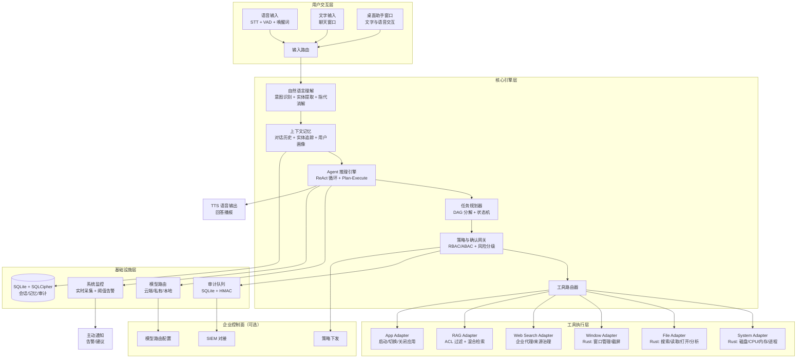
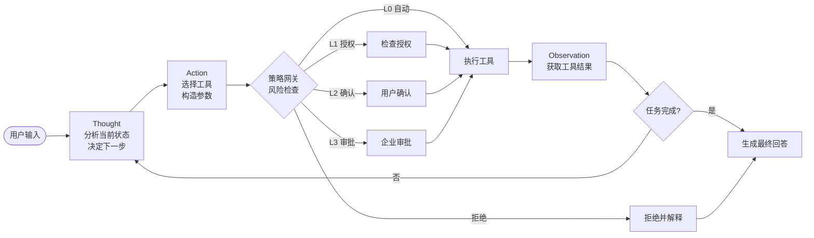
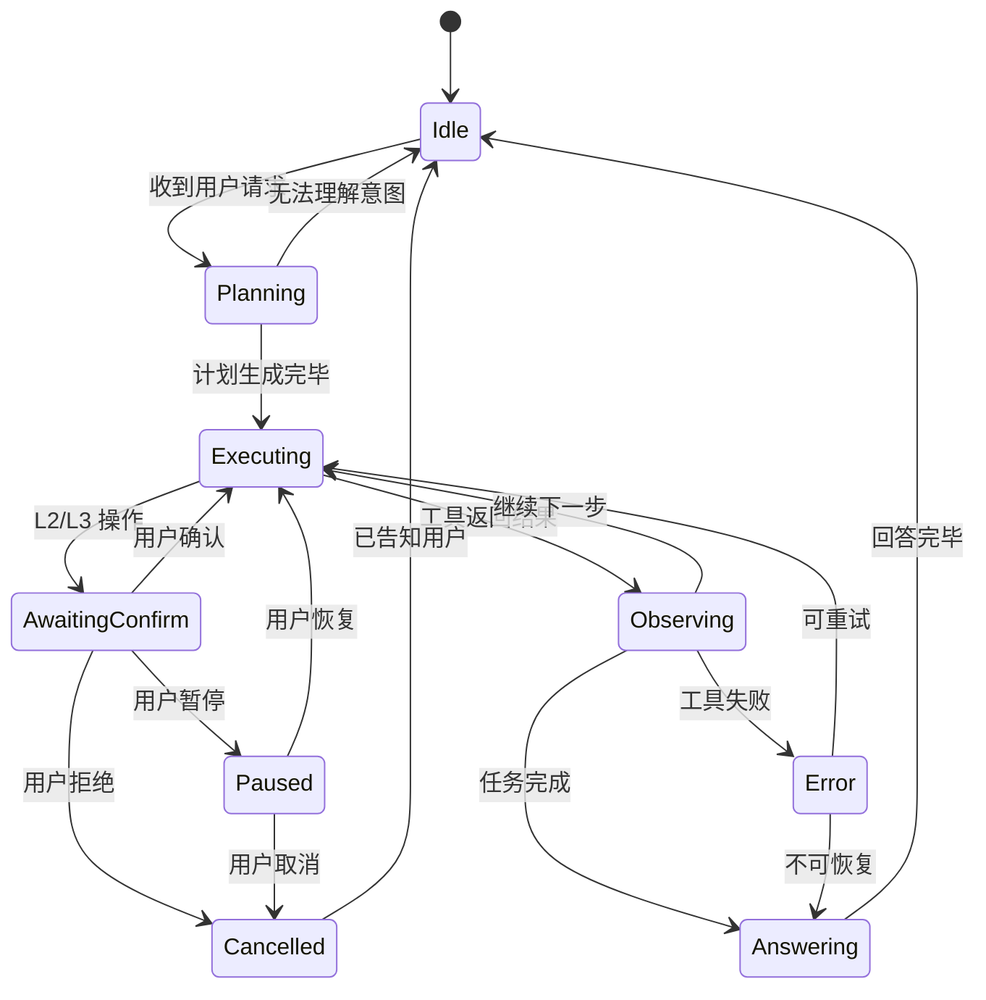
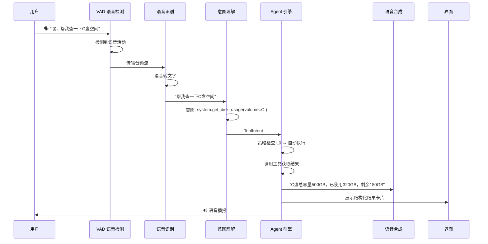
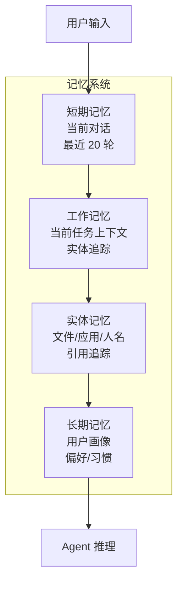
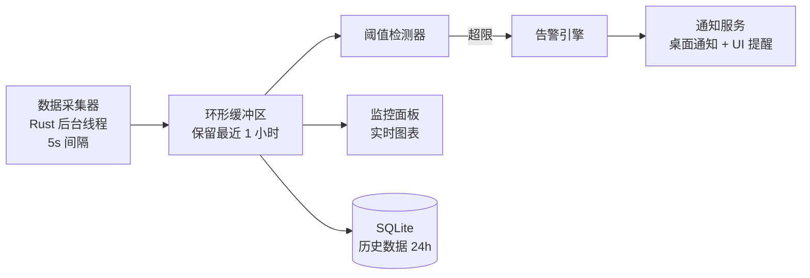
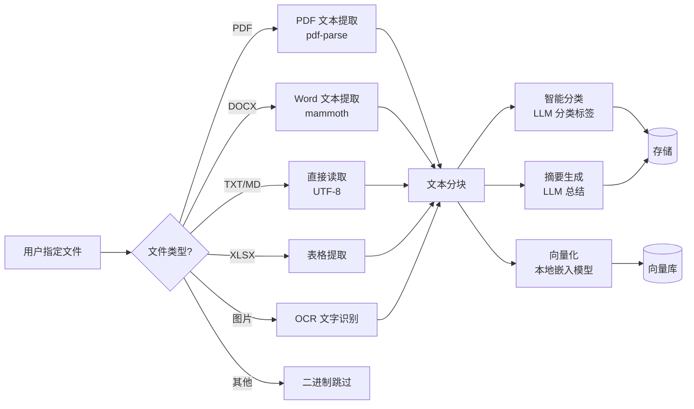
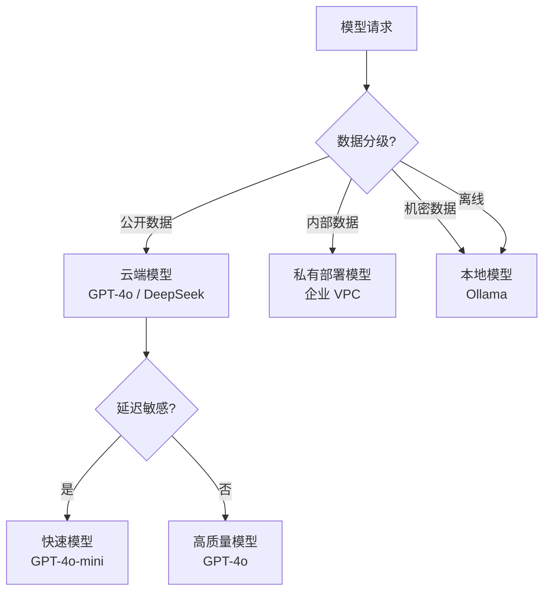

# 贾维斯桌面智能助手技术方案（V2.0）

> **核心愿景**：打造真正的人工助手——用户只需一句话，助手即可理解意图、规划步骤、调用工具、执行操作并返回结果。如同钢铁侠中的 JARVIS，自然交互、主动智能、安全可控。
>
> **版本**：V2.0 | **日期**：2026-07-15 | **前置方案**：ENTERPRISE_DESKTOP_ASSISTANT_PLAN.md V1.0

---

## 目录

- [1. 产品愿景与核心能力](#1-产品愿景与核心能力)
- [2. V1.0 方案评估与差距分析](#2-v10-方案评估与差距分析)
- [3. 总体架构](#3-总体架构)
- [4. Agent 推理引擎](#4-agent-推理引擎)
- [5. 语音交互系统](#5-语音交互系统)
- [6. 工具系统与能力目录](#6-工具系统与能力目录)
- [7. Rust 本机工具适配器](#7-rust-本机工具适配器)
- [8. 上下文记忆与用户画像](#8-上下文记忆与用户画像)
- [9. 实时系统监控](#9-实时系统监控)
- [10. 桌面自动化能力](#10-桌面自动化能力)
- [11. 文件智能分析](#11-文件智能分析)
- [12. 安全与权限模型（继承 V1）](#12-安全与权限模型继承-v1)
- [13. 数据、模型与 RAG](#13-数据模型与-rag)
- [14. 前端交互架构](#14-前端交互架构)
- [15. 离线降级策略](#15-离线降级策略)
- [16. 可观测性与审计](#16-可观测性与审计)
- [17. 交付与工程实践](#17-交付与工程实践)
- [18. 分阶段实施路线](#18-分阶段实施路线)
- [19. 首期开发切片](#19-首期开发切片)
- [20. 决策清单](#20-决策清单)

---

## 1. 产品愿景与核心能力

### 1.1 JARVIS 级助手的核心特征

| 特征 | 描述 | 用户感受 |
|------|------|----------|
| **自然交互** | 语音 + 文字 + 手势，多模态输入 | "嘿，贾维斯" 即可开始对话 |
| **意图理解** | 理解自然语言、指代消解、隐含需求 | "打开昨天的合同" → 自动定位+打开 |
| **任务编排** | 将复杂请求分解为多步计划并逐步执行 | "整理桌面文件" → 分类+移动+报告 |
| **主动智能** | 监控系统状态，主动提供建议和告警 | "C 盘空间不足，建议清理临时文件" |
| **上下文记忆** | 记住对话历史、用户习惯和偏好 | "跟上次一样的格式保存" |
| **安全可控** | 所有操作经授权，可审计可回滚 | 危险操作前必须确认 |

### 1.2 首期能力场景

| 场景 | 用户示例 | 执行链路 | 风险等级 |
|------|----------|----------|----------|
| 系统信息查询 | "C 盘还剩多少空间？" | 意图理解 → disk_usage 工具 → 结构化回答 | L0 只读 |
| 文件查找 | "帮我找昨天编辑的文件" | 意图理解 → 时间解析 → file_search(scope, modified_after) → 结果展示 | L1 只读敏感 |
| 文件打开 | "打开桌面上的合同" | 意图理解 → file_search → 用户确认 → open_file | L2 可逆写入 |
| 系统监控 | "CPU 使用率怎么样？" | 意图理解 → system_stats 工具 → 实时展示 | L0 只读 |
| 进程管理 | "看看哪些程序占内存多" | 意图理解 → list_processes → 排序展示 | L1 只读敏感 |
| 网络搜索 | "搜索今天的行业新闻" | 意图理解 → web_search → 结果展示 | L0/L1 |
| 文件分析 | "这个 PDF 讲了什么？" | 意图理解 → read_file_content → LLM 总结 | L1 只读敏感 |
| 批量操作 | "整理下载文件夹" | 计划生成 → 分类策略 → 用户确认 → 批量移动 | L2/L3 |
| 语音交互 | "嘿，帮我查一下..." | 唤醒词 → STT → 意图理解 → 执行 → TTS 回答 | 依操作而定 |
| 跨步骤编排 | "找到报告然后发给我同事" | 计划: search → read → compose → confirm → send | L2/L3 |

### 1.3 非目标（MVP 不做）

- 不提供任意 Shell/PowerShell/注册表执行能力。
- 不以管理员权限运行；需要提权的操作转交 Windows UAC。
- 不进行无提示的批量删除、外发文件、安装软件。
- 不把用户桌面、剪贴板或企业文档默认上传给模型服务。
- 不实现远程控制其他设备（首期仅本机操作）。

### 1.4 设计原则

1. **自然优先**：用户用自然语言表达意图，系统负责理解和执行。
2. **最小权限**：模型从不直接拥有操作系统权限，工具网关统一控制。
3. **读写分级**：只读可自动执行；有副作用的动作必须确认；高风险动作必须强确认。
4. **策略优先于提示词**：权限、路径、脱敏与审批由确定性策略引擎决定。
5. **本地优先、云端可选**：敏感上下文默认留在终端；企业可选择私有部署。
6. **全链路可追溯**：每次工具调用均具备完整审计记录。
7. **优雅降级**：断网时保留本地只读能力并明确告知用户。

---

## 2. V1.0 方案评估与差距分析

### 2.1 V1.0 方案的成熟部分（继承）

V1.0 方案在以下方面设计成熟，V2.0 直接继承：

- ✅ 产品边界与原则（1.1-1.4）
- ✅ 风险分级模型（L0-L4）
- ✅ 确认协议（草案→策略→令牌→执行→审计）
- ✅ 信任边界设计（渲染层不直接调用系统 API）
- ✅ 安全合规基线（loopback、CSP、签名、加密）
- ✅ 分阶段实施思路

### 2.2 V1.0 方案的关键缺失

| # | 缺失领域 | V1.0 现状 | V2.0 补充内容 | 影响 |
|---|---------|-----------|-------------|------|
| 1 | **Agent 推理引擎** | 提到"编排器"但无设计 | ReAct 循环、Plan-Execute 模式、多步推理协议 | 无法完成"找到文件并打开"等组合任务 |
| 2 | **语音交互** | 完全未提及 | STT 唤醒 + TTS 回答 + VAD 降噪 | 无法实现"一句话完成" |
| 3 | **上下文记忆** | 未设计 | 对话记忆、实体追踪、时间指代消解 | 无法理解"昨天""那个文件" |
| 4 | **实时系统监控** | 仅一次性查询 | 监控看板、阈值告警、趋势图 | 无法主动告知"C 盘快满了" |
| 5 | **桌面自动化** | 仅 open_file | 窗口管理、进程查询、截屏分析、应用启动 | 能力覆盖面窄 |
| 6 | **文件内容智能分析** | 仅搜索文件名 | 内容提取、智能分类、摘要生成、语义搜索 | 无法回答"这个文件讲了什么" |
| 7 | **Rust 工具适配器** | 提到但无设计 | 具体的 Rust trait、模块划分、错误处理 | 落地实现路径不清 |
| 8 | **用户画像与个性化** | 未设计 | 偏好记忆、常用路径、个性化命令 | 用户体验不够"懂你" |
| 9 | **离线降级策略** | 仅"降级提示" | 本地模型、工具降级、缓存策略 | 断网体验差 |
| 10 | **多步任务编排协议** | 未设计 | 任务 DAG、状态机、暂停/恢复/回滚 | 无法执行复杂操作 |

### 2.3 当前代码库技术债务

基于对项目源码的完整分析，以下问题需在新方案中解决：

| 优先级 | 问题 | 根因 | V2.0 解决方案 |
|--------|------|------|-------------|
| **高** | `main.rs` 依赖 `npx tsx src/server.ts`，生产打包失败 | 未编译 Node 后端为可执行 sidecar | Rust sidecar 全面接管系统工具；TS 仅负责编排 |
| **高** | 桌面前端 fetch 未统一携带 local token | 前端代码重复且不一致 | 统一 API 客户端层 |
| **高** | `ragAgent.ts` 双 API 路径大量重复 | OpenAI Responses API 与 Chat Completions 两套逻辑 | 抽象为统一 Provider 接口 |
| **中** | `webSearch.ts` 正则解析 HTML，极度脆弱 | 无搜索引擎 API | 接入企业搜索 API + 本地缓存 |
| **中** | 多个前端入口的 SSE 解析逻辑重复 | 无公共模块 | 提取 SSE 客户端工具 |
| **中** | actions 内存存储无持久化 | 进程重启丢失 | SQLite 持久化 |
| **中** | API Key 明文存储在 JSON | 无密钥管理 | Windows Credential Manager / DPAPI |
| **低** | audit JSONL 无轮转/防篡改 | 文件无限增长 | 轮转 + HMAC 链式签名 |
| **低** | `main.rs` 单文件无 lib.rs 拆分 | 不可测试 | 拆分 lib.rs + 集成测试 |

---

## 3. 总体架构

### 3.1 架构全景



### 3.2 部署形态

| 层级 | 组件 | 部署位置 | 说明 |
|------|------|----------|------|
| **终端数据面** | Tauri UI + Assistant Runtime + 工具适配器 + 本地加密缓存 | 用户设备 | 所有用户操作在此执行 |
| **终端数据面** | 本地监控 Agent + 通知服务 | 用户设备 | 持续运行，低资源占用 |
| **企业控制面** | 身份联合、策略下发、集中审计、模型路由 | 企业服务器 | 可选，无企业环境时跳过 |
| **云端模型** | LLM API（OpenAI 兼容） | 云端 | 仅收到策略允许且脱敏后的最小上下文 |
| **本地模型** | Ollama / 本地推理 | 用户设备 | 离线降级 + 隐私敏感任务 |

### 3.3 信任边界

继承 V1.0 设计并扩展：

1. **渲染层**不直接调用系统 API、Shell 或第三方网站。
2. **模型**仅输出结构化 `ToolIntent`（如 `filesystem.search({ scope: "desktop", modified_after: "2026-07-14" })`），不能构造命令行。
3. **策略网关**将意图映射到已注册的工具契约、验证参数、评估风险并签发一次性确认令牌。
4. **工具适配器**只接受"已授权 + 未过期 + 与参数哈希匹配"的调用。
5. **语音输入**被视为不可信数据，经过 NLU 处理后进入编排器，不能直接触发工具调用。
6. **系统监控数据**只在本机处理，不上传除非用户明确授权。

### 3.4 进程架构

```
┌─────────────────────────────────────────────────────┐
│                    Tauri Main (Rust)                 │
│  ┌──────────┐  ┌──────────┐  ┌───────────────────┐ │
│  │ Main     │  │ Pet      │  │ Rust Tool Engine  │ │
│  │ Window   │  │ Window   │  │ (sidecar module)  │ │
│  │ (React)  │  │ (Canvas) │  │                   │ │
│  └────┬─────┘  └────┬─────┘  │ ┌───────────────┐ │ │
│       │              │        │ │ System Adapter│ │ │
│       │    IPC       │        │ │ File Adapter  │ │ │
│       ├──────────────┤        │ │ Window Adapter│ │ │
│       │              │        │ │ App Adapter   │ │ │
│  ┌────▼──────────────▼────┐   │ └───────────────┘ │ │
│  │  Assistant Runtime     │   │                     │
│  │  (TypeScript / Bun)    │◄─►│  SQLite (SQLCipher) │ │
│  │                        │   │  Audit Queue        │ │
│  │  ┌──────────────────┐  │   └───────────────────┘ │
│  │  │ Agent Engine     │  │                          │
│  │  │ NLU / Memory     │  │   ┌───────────────────┐ │
│  │  │ Tool Router      │  │   │ Monitor Service   │ │
│  │  └──────────────────┘  │   │ (Rust thread)     │ │
│  └────────────────────────┘   └───────────────────┘ │
└─────────────────────────────────────────────────────┘
         │ loopback HTTP (127.0.0.1:port)
         │ + random token
         ▼
    External APIs (LLM / Web Search / Enterprise)
```

**关键改进**（相比 V1.0）：
- 系统工具从 Node.js 迁移到 **Rust 原生实现**，通过 Tauri Command 调用，不再依赖 `npx tsx`。
- TS Runtime 仅负责 Agent 编排、NLU 和工具路由逻辑。
- 监控服务作为 Rust 线程运行，资源占用极低。
- 生产打包不再需要用户机器有 Node.js。

---

## 4. Agent 推理引擎

### 4.1 ReAct 循环（核心推理模式）

Agent 采用 **ReAct（Reasoning + Acting）** 模式，在"思考-行动-观察"循环中逐步推进任务：



### 4.2 Plan-Execute 模式（复杂任务编排）

对于需要多步骤的任务，Agent 先生成执行计划（DAG），再逐步执行：

```typescript
// 任务计划数据结构
interface TaskPlan {
  plan_id: string;
  user_request: string;           // 原始用户请求
  created_at: string;
  steps: TaskStep[];
  status: 'planning' | 'executing' | 'paused' | 'completed' | 'failed' | 'cancelled';
}

interface TaskStep {
  step_id: string;
  description: string;             // 人可读描述，如 "在桌面搜索昨天修改的文件"
  tool: string;                   // 工具名称
  params: Record<string, unknown>; // 工具参数
  depends_on: string[];           // 前置步骤 ID
  risk_level: 'L0' | 'L1' | 'L2' | 'L3';
  status: 'pending' | 'awaiting_confirm' | 'executing' | 'completed' | 'failed' | 'skipped';
  result?: unknown;              // 执行结果
  error?: string;
  started_at?: string;
  completed_at?: string;
}
```

**示例**：用户说"找到昨天的合同然后打开"

```json
{
  "plan_id": "plan_001",
  "user_request": "找到昨天的合同然后打开",
  "steps": [
    {
      "step_id": "s1",
      "description": "在桌面和文档目录搜索昨天修改的合同文件",
      "tool": "filesystem.search",
      "params": { "scope": ["desktop", "documents"], "query": "合同", "modified_after": "2026-07-14T00:00:00" },
      "depends_on": [],
      "risk_level": "L1",
      "status": "pending"
    },
    {
      "step_id": "s2",
      "description": "展示搜索结果供用户选择",
      "tool": "ui.present_choices",
      "params": {},
      "depends_on": ["s1"],
      "risk_level": "L0",
      "status": "pending"
    },
    {
      "step_id": "s3",
      "description": "用默认应用打开用户选择的文件",
      "tool": "shell.open_with_default_app",
      "params": { "path": "{s2.selection}" },
      "depends_on": ["s2"],
      "risk_level": "L2",
      "status": "pending"
    }
  ]
}
```

### 4.3 Agent 协议设计

```typescript
// Agent 消息协议
interface AgentMessage {
  role: 'system' | 'user' | 'assistant' | 'tool';
  content: string;
  tool_calls?: ToolCall[];
  tool_call_id?: string;
  metadata?: {
    thought?: string;           // Agent 的推理过程（可选展示给用户）
    plan?: TaskPlan;            // 当前执行计划
    step_id?: string;           // 当前步骤
    confidence?: number;        // 置信度 0-1
  };
}

// 工具调用意图
interface ToolIntent {
  tool: string;                  // 工具名，如 "filesystem.search"
  params: Record<string, unknown>;
  reason: string;                // 为什么调用此工具（人可读）
  risk_level: 'L0' | 'L1' | 'L2' | 'L3';
}

// Agent 响应
interface AgentResponse {
  thought: string;               // 当前推理
  action?: ToolIntent;           // 下一步行动（无则直接回答）
  answer?: string;                // 最终回答（任务完成时）
  plan?: TaskPlan;               // 新计划或计划更新
  status: 'thinking' | 'acting' | 'observing' | 'answering' | 'error';
}
```

### 4.4 多轮对话状态管理



### 4.5 错误处理与重试策略

| 错误类型 | 处理策略 | 用户可见 |
|----------|----------|----------|
| 工具超时 | 自动重试 1 次，超时后告知用户 | 是 |
| 工具参数错误 | Agent 重新分析并修正参数 | 是（简要说明） |
| 权限不足 | 告知用户需要授权，引导授权流程 | 是 |
| 模型不可用 | 切换备用模型或本地模型 | 是（降级提示） |
| 网络断开 | 使用本地工具和缓存，告知离线状态 | 是 |
| 工具执行异常 | 记录错误，提供恢复建议 | 是 |

---

## 5. 语音交互系统

### 5.1 语音交互流程



### 5.2 技术选型

| 组件 | 推荐方案 | 备选 | 理由 |
|------|----------|------|------|
| **语音活动检测 (VAD)** | `@ricky0123/vad-web`（浏览器 WASM VAD） | Tauri Rust 侧 `silero-vad` | 前端集成简单，低延迟 |
| **语音识别 (STT)** | **方案A**：浏览器 Web Speech API（免费、低延迟）<br/>**方案B**：Whisper.cpp 本地部署（隐私、离线）<br/>**方案C**：Azure Speech SDK（企业级） | OpenAI Whisper API | 分层选择：MVP 用方案A，隐私场景用方案B，企业用方案C |
| **语音合成 (TTS)** | **方案A**：浏览器 SpeechSynthesis API（免费）<br/>**方案B**：Edge TTS（高质量中文）<br/>**方案C**：Azure Neural TTS（企业级） | Coqui TTS 本地部署 | 当前已用方案A，后续升级 |
| **唤醒词** | 按键触发（MVP）→ Tauri 全局快捷键 → 离线唤醒词模型（Porcupine/OpenWakeWord） | 始终监听（隐私+电量问题） | 渐进式实现 |
| **降噪** | WebRTC AEC/NS（浏览器内置） | RNNoise | 免依赖 |

### 5.3 语音交互模式

| 模式 | 触发方式 | 适用场景 |
|------|----------|----------|
| **按键说话** | 按住快捷键或按钮 | MVP 首选，隐私可控 |
| **唤醒词** | "嘿，贾维斯" | 进阶体验，需离线唤醒词模型 |
| **持续对话** | 完成一轮后继续倾听 | 连续指令场景 |
| **文字+语音混合** | 用户随时切换输入方式 | 灵活交互 |

### 5.4 语音用户体验设计

- **输入反馈**：检测到语音时显示波形动画，识别中显示"正在聆听..."。
- **打断支持**：Agent 回答时用户可说话打断（Barge-in）。
- **语速控制**：设置中可调整 TTS 语速（0.5x-2.0x）。
- **静音模式**：一键关闭语音输出，仅保留文字。
- **多语言**：自动检测中英文混合输入，TTS 自动切换语音。

---

## 6. 工具系统与能力目录

### 6.1 工具分类与风险等级

#### L0 - 只读低敏（自动执行）

```text
system.get_disk_usage(volume)              # 磁盘空间查询
system.get_cpu_usage()                     # CPU 使用率
system.get_memory_info()                   # 内存信息
system.get_network_info()                  # 网络状态
system.get_battery_status()                # 电池状态
system.get_os_info()                       # 操作系统信息
system.get_datetime(timezone?)              # 当前日期时间
system.list_processes(sort_by?, limit?)     # 进程列表（只读）
system.get_process_detail(pid)             # 进程详情
web.search(query, allowed_domains?, locale?) # 网络搜索
knowledge.search(query, data_scope?)        # 知识库检索
calculate(expression)                       # 数学计算
```

#### L1 - 只读敏感（首次授权后自动）

```text
filesystem.search(scope, query?, modified_after?, modified_before?, max_results)
filesystem.list_directory(path, page_token?)
filesystem.get_file_metadata(path)
filesystem.read_file_content(path, max_bytes)   # 文件内容读取（用于分析）
filesystem.list_recent_files(scope, hours)       # 最近编辑的文件
clipboard.read()                                  # 剪贴板读取（需授权）
window.list_windows()                             # 窗口列表
window.get_active_window()                        # 当前活动窗口
```

#### L2 - 可逆写入（执行预览 + 单次确认）

```text
shell.open_with_default_app(path)               # 打开文件
shell.open_url(url)                              # 打开网页（白名单）
app.launch(app_name_or_path)                    # 启动应用程序
app.switch_to(window_title_or_pid)              # 切换到指定窗口
filesystem.create_file(path, content)            # 新建文件
filesystem.move_file(src, dest)                  # 移动文件（到回收站可逆）
filesystem.copy_file(src, dest)                  # 复制文件
filesystem.create_directory(path)               # 创建目录
filesystem.rename(old_path, new_path)           # 重命名
window.minimize(window_id)                       # 最小化窗口
window.maximize(window_id)                       # 最大化窗口
window.close(window_id)                          # 关闭窗口
clipboard.write(text)                            # 写入剪贴板
```

#### L3 - 破坏性/外发（强确认 + 企业审批）

```text
filesystem.delete_file(path, permanent?)       # 删除文件（默认回收站，permanent=true 需强确认）
filesystem.batch_move(items[])                   # 批量移动文件
filesystem.delete_directory(path, recursive?)   # 删除目录
shell.run_managed_command(allowlist_command)    # 受控命令执行（严格白名单）
notify.send_email(to, subject, body)            # 发送邮件
```

#### L4 - 特权（默认不支持）

```text
# 默认拒绝，仅 IT 管理设备可启用
shell.run_admin_command(command)    # 管理员命令
registry.read(key)                   # 注册表读取
registry.write(key, value)           # 注册表写入
```

### 6.2 工具契约规范

每个工具必须定义完整的 JSON Schema 契约：

```typescript
interface ToolContract {
  name: string;                    // 工具全名，如 "filesystem.search"
  category: 'system' | 'filesystem' | 'shell' | 'web' | 'knowledge' | 'window' | 'app' | 'clipboard' | 'notify';
  risk_level: 'L0' | 'L1' | 'L2' | 'L3' | 'L4';
  description: string;             // 工具描述（供 LLM 理解）
  input_schema: JSONSchema;        // 输入参数 JSON Schema
  output_schema: JSONSchema;       // 输出结构 JSON Schema
  max_results?: number;            // 最大返回结果数
  timeout_ms: number;              // 超时时间
  rate_limit?: {                   // 速率限制
    max_calls: number;
    window_seconds: number;
  };
  requires_authorization?: boolean; // 是否需要目录/资源授权
  requires_confirmation?: boolean;  // 是否需要用户确认
  rollback?: {                      // 回滚能力
    supported: boolean;
    description?: string;
  };
  audit_fields: string[];           // 审计必须记录的字段
}
```

### 6.3 工具目录注册示例

```typescript
const TOOL_REGISTRY: Record<string, ToolContract> = {
  'system.get_disk_usage': {
    name: 'system.get_disk_usage',
    category: 'system',
    risk_level: 'L0',
    description: '查询指定磁盘卷的总容量和可用空间。支持 C:、D: 等卷标。',
    input_schema: {
      type: 'object',
      properties: {
        volume: { type: 'string', pattern: '^[A-Z]:$', description: '磁盘卷标，如 C:' }
      },
      required: ['volume']
    },
    output_schema: {
      type: 'object',
      properties: {
        volume: { type: 'string' },
        total_bytes: { type: 'number' },
        available_bytes: { type: 'number' },
        used_bytes: { type: 'number' },
        used_percentage: { type: 'number' },
        sampled_at: { type: 'string', format: 'date-time' }
      }
    },
    timeout_ms: 5000,
    audit_fields: ['volume', 'total_bytes', 'available_bytes']
  },

  'filesystem.search': {
    name: 'filesystem.search',
    category: 'filesystem',
    risk_level: 'L1',
    description: '在已授权目录中搜索文件。支持按文件名、修改时间、文件类型过滤。',
    input_schema: {
      type: 'object',
      properties: {
        scope: { type: 'array', items: { type: 'string' }, description: '搜索范围，如 ["desktop", "documents"]' },
        query: { type: 'string', description: '文件名关键词（可选，不填则列出全部）' },
        modified_after: { type: 'string', format: 'date-time', description: '修改时间下限' },
        modified_before: { type: 'string', format: 'date-time', description: '修改时间上限' },
        file_types: { type: 'array', items: { type: 'string' }, description: '文件类型过滤，如 ["pdf", "docx"]' },
        max_results: { type: 'number', default: 20, maximum: 100 }
      },
      required: ['scope']
    },
    output_schema: {
      type: 'object',
      properties: {
        results: {
          type: 'array',
          items: {
            type: 'object',
            properties: {
              path: { type: 'string' },
              name: { type: 'string' },
              size_bytes: { type: 'number' },
              modified_at: { type: 'string', format: 'date-time' },
              file_type: { type: 'string' }
            }
          }
        },
        total_found: { type: 'number' },
        truncated: { type: 'boolean' }
      }
    },
    timeout_ms: 30000,
    max_results: 100,
    rate_limit: { max_calls: 10, window_seconds: 60 },
    requires_authorization: true,
    audit_fields: ['scope', 'query', 'modified_after', 'total_found']
  }
};
```

---

## 7. Rust 本机工具适配器

### 7.1 模块架构

```rust
// src-tauri/src/lib.rs (新增，从 main.rs 拆分)
pub mod adapters;
pub mod monitoring;

// src-tauri/src/adapters/mod.rs
pub mod system;
pub mod filesystem;
pub mod window;
pub mod app;
pub mod clipboard;

// 统一工具 trait
#[async_trait::async_trait]
pub trait ToolAdapter: Send + Sync {
    fn name(&self) -> &str;
    fn risk_level(&self) -> RiskLevel;

    async fn execute(
        &self,
        params: serde_json::Value,
        context: &ToolContext,
    ) -> Result<ToolResult, ToolError>;
}

pub struct ToolContext {
    pub authorized_paths: Vec<PathBuf>,
    pub confirmation_token: Option<String>,
    pub user_id: String,
    pub session_id: String,
    pub timeout: Duration,
}

pub struct ToolResult {
    pub success: bool,
    pub data: serde_json::Value,
    pub error: Option<String>,
    pub metadata: HashMap<String, serde_json::Value>,
}

pub enum RiskLevel { L0, L1, L2, L3, L4 }
```

### 7.2 System Adapter（Rust 实现）

```rust
// src-tauri/src/adapters/system.rs
use sysinfo::{System, Disks, Networks};

pub struct SystemAdapter {
    sys: Mutex<System>,
}

impl SystemAdapter {
    pub fn get_disk_usage(&self, volume: &str) -> Result<DiskUsage, ToolError> {
        let disks = Disks::new_with_refreshed_list();
        let disk = disks.list().iter()
            .find(|d| {
                let mount = d.mount_point().to_string_lossy().to_uppercase();
                mount.starts_with(volume)
            })
            .ok_or(ToolError::NotFound(format!("Volume {} not found", volume)))?;

        Ok(DiskUsage {
            volume: volume.to_string(),
            total_bytes: disk.total_space(),
            available_bytes: disk.available_space(),
            used_bytes: disk.total_space() - disk.available_space(),
            used_percentage: ((disk.total_space() - disk.available_space()) as f64
                / disk.total_space() as f64 * 100.0).round() as u8,
            sampled_at: chrono::Local::now().to_rfc3339(),
        })
    }

    pub fn get_cpu_usage(&self) -> Result<CpuInfo, ToolError> {
        let mut sys = self.sys.lock().unwrap();
        sys.refresh_cpu_usage();
        // 等待一个刷新周期以获取准确值
        std::thread::sleep(sysinfo::MINIMUM_CPU_UPDATE_INTERVAL);
        sys.refresh_cpu_usage();

        let overall = sys.cpus().iter()
            .map(|c| c.cpu_usage())
            .sum::<f32>() / sys.cpus().len() as f32;

        Ok(CpuInfo {
            overall_usage_percent: overall.round() as u8,
            core_count: sys.cpus().len() as u32,
            per_core: sys.cpus().iter().map(|c| c.cpu_usage().round() as u8).collect(),
            sampled_at: chrono::Local::now().to_rfc3339(),
        })
    }

    pub fn get_memory_info(&self) -> Result<MemoryInfo, ToolError> {
        let mut sys = self.sys.lock().unwrap();
        sys.refresh_memory();

        Ok(MemoryInfo {
            total_bytes: sys.total_memory(),
            available_bytes: sys.available_memory(),
            used_bytes: sys.total_memory() - sys.available_memory(),
            used_percentage: ((sys.total_memory() - sys.available_memory()) as f64
                / sys.total_memory() as f64 * 100.0).round() as u8,
            sampled_at: chrono::Local::now().to_rfc3339(),
        })
    }

    pub fn list_processes(&self, sort_by: &str, limit: usize) -> Result<Vec<ProcessInfo>, ToolError> {
        let mut sys = self.sys.lock().unwrap();
        sys.refresh_processes();

        let mut processes: Vec<ProcessInfo> = sys.processes().iter()
            .map(|(pid, p)| ProcessInfo {
                pid: pid.as_u32(),
                name: p.name().to_string(),
                cpu_usage: p.cpu_usage(),
                memory_bytes: p.memory(),
                command: p.exe().to_string_lossy().to_string(),
            })
            .collect();

        match sort_by {
            "memory" => processes.sort_by(|a, b| b.memory_bytes.cmp(&a.memory_bytes)),
            "cpu" => processes.sort_by(|a, b| b.cpu_usage.partial_cmp(&a.cpu_usage).unwrap()),
            _ => {}
        }

        processes.truncate(limit);
        Ok(processes)
    }
}
```

### 7.3 Filesystem Adapter（Rust 实现）

```rust
// src-tauri/src/adapters/filesystem.rs
use walkdir::WalkDir;
use std::path::{Path, PathBuf};

pub struct FilesystemAdapter;

impl FilesystemAdapter {
    pub fn search(
        &self,
        scope: &[String],
        query: Option<&str>,
        modified_after: Option<DateTime<Utc>>,
        modified_before: Option<DateTime<Utc>>,
        file_types: &[String],
        max_results: usize,
        authorized_paths: &[PathBuf],
    ) -> Result<SearchResult, ToolError> {
        let mut results = Vec::new();

        for scope_dir in scope {
            // 安全校验：确保 scope 在授权目录内
            let resolved = resolve_scope_path(scope_dir)?;
            if !is_authorized(&resolved, authorized_paths) {
                return Err(ToolError::Unauthorized(format!(
                    "Path {} is not in authorized directories", resolved.display()
                )));
            }

            // 符号链接逃逸防护
            let walker = WalkDir::new(&resolved)
                .follow_links(false)           // 不跟随符号链接
                .max_depth(10)                  // 限制深度
                .into_iter()
                .filter_entry(|e| !is_hidden(e)); // 跳过隐藏文件

            for entry in walker {
                let entry = entry.map_err(|e| ToolError::IoError(e.to_string()))?;
                let metadata = entry.metadata().ok().unwrap();

                // 时间过滤
                if let Some(after) = modified_after {
                    let modified = metadata.modified()
                        .map_err(|e| ToolError::IoError(e.to_string()))?;
                    if modified < after.into() { continue; }
                }
                if let Some(before) = modified_before {
                    let modified = metadata.modified()
                        .map_err(|e| ToolError::IoError(e.to_string()))?;
                    if modified > before.into() { continue; }
                }

                // 文件类型过滤
                if !file_types.is_empty() {
                    let ext = entry.path().extension()
                        .and_then(|e| e.to_str())
                        .unwrap_or("");
                    if !file_types.contains(&ext.to_lowercase()) { continue; }
                }

                // 关键词过滤
                if let Some(q) = query {
                    let name = entry.file_name().to_string_lossy().to_lowercase();
                    if !name.contains(&q.to_lowercase()) { continue; }
                }

                results.push(FileInfo {
                    path: entry.path().to_string_lossy().to_string(),
                    name: entry.file_name().to_string_lossy().to_string(),
                    size_bytes: metadata.len(),
                    modified_at: metadata.modified()
                        .ok()
                        .and_then(|t| t.duration_since(UNIX_EPOCH).ok())
                        .map(|d| DateTime::from_timestamp(d.as_secs() as i64, 0).unwrap())
                        .map(|dt| dt.to_rfc3339()),
                    file_type: entry.path().extension()
                        .and_then(|e| e.to_str())
                        .unwrap_or("").to_string(),
                });

                if results.len() >= max_results { break; }
            }
        }

        let total_found = results.len();
        Ok(SearchResult { results, total_found, truncated: total_found >= max_results })
    }

    pub fn list_recent_files(
        &self,
        scope: &[String],
        hours: u32,
        authorized_paths: &[PathBuf],
    ) -> Result<Vec<FileInfo>, ToolError> {
        let cutoff = Utc::now() - chrono::Duration::hours(hours as i64);
        self.search(scope, None, Some(cutoff), None, &[], 50, authorized_paths)
    }
}

// 路径安全校验
fn is_authorized(path: &Path, authorized: &[PathBuf]) -> bool {
    let canonical = path.canonicalize().unwrap_or_else(|_| path.to_path_buf());
    authorized.iter().any(|auth| {
        let auth_canonical = auth.canonicalize().unwrap_or_else(|_| auth.clone());
        canonical.starts_with(&auth_canonical)
    })
}

fn is_hidden(entry: &walkdir::DirEntry) -> bool {
    entry.file_name()
        .to_str()
        .map(|s| s.starts_with('.'))
        .unwrap_or(false)
}
```

### 7.4 Tauri Command 暴露

```rust
// src-tauri/src/lib.rs
#[tauri::command]
async fn get_disk_usage(volume: String, state: State<AppState>) -> Result<DiskUsage, String> {
    state.system_adapter.get_disk_usage(&volume)
        .map_err(|e| e.to_string())
}

#[tauri::command]
async fn get_system_stats(state: State<AppState>) -> Result<SystemStats, String> {
    let cpu = state.system_adapter.get_cpu_usage().map_err(|e| e.to_string())?;
    let mem = state.system_adapter.get_memory_info().map_err(|e| e.to_string())?;
    Ok(SystemStats { cpu, memory: mem })
}

#[tauri::command]
async fn search_files(
    scope: Vec<String>,
    query: Option<String>,
    modified_after: Option<String>,
    file_types: Vec<String>,
    state: State<AppState>,
) -> Result<SearchResult, String> {
    state.filesystem_adapter.search(
        &scope, query.as_deref(),
        modified_after.as_deref().and_then(|s| DateTime::parse_from_rfc3339(s).ok().map(|dt| dt.with_timezone(&Utc))),
        None, &file_types, 20, &state.authorized_paths,
    ).map_err(|e| e.to_string())
}

#[tauri::command]
async fn list_processes(
    sort_by: String,
    limit: usize,
    state: State<AppState>,
) -> Result<Vec<ProcessInfo>, String> {
    state.system_adapter.list_processes(&sort_by, limit)
        .map_err(|e| e.to_string())
}
```

---

## 8. 上下文记忆与用户画像

### 8.1 记忆系统架构



### 8.2 对话记忆管理

```typescript
interface ConversationMemory {
  session_id: string;
  messages: MemoryMessage[];       // 最近 N 轮对话
  entities: EntityTracker;         // 当前对话中的实体追踪
  task_context?: TaskContext;       // 当前任务上下文
  last_updated: string;
}

interface MemoryMessage {
  role: 'user' | 'assistant' | 'tool';
  content: string;
  timestamp: string;
  tool_calls?: ToolCall[];
  tool_results?: ToolResult[];
  metadata?: {
    intent?: string;
    entities?: Entity[];
  };
}

// 实体追踪器：记住对话中提到的文件、应用、人名等
interface EntityTracker {
  files: Map<string, FileEntity>;      // 提到的文件路径
  applications: Map<string, AppEntity>; // 提到的应用
  people: Map<string, PersonEntity>;    // 提到的人名
  times: Map<string, TimeEntity>;       // 时间指代（"昨天""刚才"）
}

interface FileEntity {
  ref: string;          // 引用名，如 "昨天的合同"
  actual_path: string;  // 实际路径
  mentioned_at: string;
}
```

### 8.3 时间指代消解

```typescript
// 时间表达式解析器
class TimeExpressionResolver {
  resolve(expression: string, now: Date = new Date()): Date | null {
    const patterns: Array<{ regex: RegExp; resolver: (match: RegExpMatchArray, now: Date) => Date }> = [
      // "今天"
      { regex: /今天|today/i, resolver: (_, now) => startOfDay(now) },
      // "昨天"
      { regex: /昨天|yesterday/i, resolver: (_, now) => startOfDay(subDays(now, 1)) },
      // "前天"
      { regex: /前天/i, resolver: (_, now) => startOfDay(subDays(now, 2)) },
      // "三天前"
      { regex: /(\d+)天前/i, resolver: (m, now) => startOfDay(subDays(now, parseInt(m[1]))) },
      // "上周"
      { regex: /上周|last week/i, resolver: (_, now) => startOfWeek(subWeeks(now, 1)) },
      // "这周"
      { regex: /这周|this week/i, resolver: (_, now) => startOfWeek(now) },
      // "刚才" (1小时内)
      { regex: /刚才|刚刚/i, resolver: (_, now) => subHours(now, 1) },
      // "今天上午"
      { regex: /今天上午|this morning/i, resolver: (_, now) => { const d = startOfDay(now); d.setHours(0, 0, 0); return d; } },
      // "今天下午"
      { regex: /今天下午|this afternoon/i, resolver: (_, now) => { const d = startOfDay(now); d.setHours(12, 0, 0); return d; } },
      // 具体日期 "7月14日"
      { regex: /(\d{1,2})月(\d{1,2})日?/, resolver: (m, now) => { const d = new Date(now); d.setMonth(parseInt(m[1]) - 1, parseInt(m[2])); d.setHours(0, 0, 0, 0); return d; } },
    ];

    for (const { regex, resolver } of patterns) {
      const match = expression.match(regex);
      if (match) return resolver(match, now);
    }
    return null;
  }
}
```

### 8.4 用户画像

```typescript
interface UserProfile {
  user_id: string;
  // 偏好
  preferences: {
    language: 'zh-CN' | 'en-US';
    voice_enabled: boolean;
    voice_speed: number;           // TTS 语速 0.5-2.0
    always_confirm_destructive: boolean;
    default_search_scopes: string[];  // 默认搜索目录
  };
  // 常用路径
  frequently_used_paths: {
    path: string;
    label: string;     // 用户给路径的别名
    access_count: number;
    last_accessed: string;
  }[];
  // 常用应用
  frequently_used_apps: {
    name: string;
    launch_count: number;
    last_launched: string;
  }[];
  // 命令历史模式
  command_patterns: {
    pattern: string;     // 如 "打开{文件类型}"
    tool: string;
    frequency: number;
  }[];
  // 个性化快捷指令
  custom_commands: {
    trigger: string;     // 如 "整理桌面"
    actions: TaskStep[];
  }[];
}
```

---

## 9. 实时系统监控

### 9.1 监控架构



### 9.2 监控指标

| 指标 | 采集频率 | 告警阈值 | 说明 |
|------|----------|----------|------|
| 磁盘可用空间 | 60s | < 10% 总容量 | 红色警告；< 20% 黄色提醒 |
| CPU 使用率 | 5s | > 90% 持续 30s | 告知用户高 CPU 进程 |
| 内存使用率 | 5s | > 85% | 告知用户高内存进程 |
| 网络连通性 | 30s | 断连 | 自动切换离线模式 |
| 电池电量 | 60s | < 20% | 提醒充电 |
| 磁盘 I/O | 10s | > 95% 持续 60s | 提示高 I/O 进程 |

### 9.3 监控数据结构

```rust
// src-tauri/src/monitoring/collector.rs
pub struct SystemSnapshot {
    pub timestamp: DateTime<Utc>,
    pub cpu_usage_percent: f32,
    pub memory_used_percent: u8,
    pub disk_usage: Vec<DiskSnapshot>,
    pub network_status: NetworkStatus,
    pub battery: Option<BatterySnapshot>,
    pub top_processes: Vec<ProcessSnapshot>,
}

pub struct MonitoringService {
    snapshots: Arc<RwLock<RingBuffer<SystemSnapshot>>>,
    alert_rules: Vec<AlertRule>,
    alert_callbacks: Vec<Box<dyn AlertCallback>>,
}

impl MonitoringService {
    pub fn start(&self) {
        let interval = Duration::from_secs(5);
        tokio::spawn(async move {
            loop {
                let snapshot = self.collect_snapshot().await;
                self.store_snapshot(snapshot.clone());
                self.check_alerts(&snapshot).await;
                tokio::time::sleep(interval).await;
            }
        });
    }

    async fn check_alerts(&self, snapshot: &SystemSnapshot) {
        for rule in &self.alert_rules {
            if rule.evaluate(snapshot) {
                for callback in &self.alert_callbacks {
                    callback.on_alert(rule.alert_type.clone(), snapshot).await;
                }
            }
        }
    }
}
```

### 9.4 主动通知设计

| 触发条件 | 通知方式 | 示例消息 |
|----------|----------|----------|
| 磁盘空间 < 10% | 桌面通知 + 助手气泡 | "⚠️ C盘空间不足！仅剩 15GB，建议清理临时文件。要我帮你分析吗？" |
| CPU 持续高占用 | 助手气泡 | "检测到 Chrome 占用 85% CPU，需要我帮你查看详情吗？" |
| 网络断开 | 助手状态变更 | "网络已断开，我已切换到离线模式，仍可帮你查文件和系统信息。" |
| 电池低电量 | 桌面通知 | "🔋 电量仅剩 15%，建议连接充电器。" |
| 大文件检测 | 助手气泡 | "下载目录有 3 个超过 1GB 的文件，要清理吗？" |

---

## 10. 桌面自动化能力

### 10.1 窗口管理

```rust
// src-tauri/src/adapters/window.rs
use windows::Win32::Foundation::HWND;

pub struct WindowAdapter;

impl WindowAdapter {
    pub fn list_windows(&self) -> Result<Vec<WindowInfo>, ToolError> {
        // 使用 Win32 API 枚举窗口
        let mut windows = Vec::new();
        // ... EnumWindows 实现
        Ok(windows)
    }

    pub fn get_active_window(&self) -> Result<WindowInfo, ToolError> {
        // GetForegroundWindow
    }

    pub fn minimize(&self, hwnd: isize) -> Result<(), ToolError> {
        // ShowWindow(hwnd, SW_MINIMIZE)
    }

    pub fn maximize(&self, hwnd: isize) -> Result<(), ToolError> {
        // ShowWindow(hwnd, SW_MAXIMIZE)
    }

    pub fn close(&self, hwnd: isize) -> Result<(), ToolError> {
        // PostMessage(hwnd, WM_CLOSE, 0, 0)
    }

    pub fn switch_to(&self, title_or_pid: &str) -> Result<(), ToolError> {
        // 按标题或 PID 查找窗口并 SetForegroundWindow
    }
}
```

### 10.2 应用启动

```rust
// src-tauri/src/adapters/app.rs
pub struct AppAdapter;

impl AppAdapter {
    pub fn launch(&self, name_or_path: &str) -> Result<u32, ToolError> {
        // 1. 检查是否在应用白名单中
        // 2. 如果是名称，查找注册的安装路径
        // 3. 使用 ShellExecuteW 启动
        // 4. 返回 PID
    }

    pub fn list_installed_apps(&self) -> Result<Vec<AppInfo>, ToolError> {
        // 从注册表和开始菜单读取已安装应用列表
    }
}
```

### 10.3 截屏分析

```rust
// src-tauri/src/adapters/screenshot.rs
pub struct ScreenshotAdapter;

impl ScreenshotAdapter {
    pub fn capture_screen(&self, monitor_id: Option<u32>) -> Result<Screenshot, ToolError> {
        // 使用 windows crate 的 Graphics::Capture API
        // 返回 PNG 字节流
    }

    pub fn capture_window(&self, hwnd: isize) -> Result<Screenshot, ToolError> {
        // 捕获指定窗口
    }
}
```

截屏后可传入 LLM 的视觉模型进行分析（例如"这个报错窗口是什么意思？"）。

---

## 11. 文件智能分析

### 11.1 文件内容提取管线



### 11.2 文件分析工具

```text
filesystem.read_file_content(path, max_bytes=65536)   # L1 读取文件内容
filesystem.analyze_file(path)                          # L1 智能分析：类型+摘要+关键词
filesystem.classify_files(directory)                   # L1 批量分类目录下文件
filesystem.find_duplicates(scope)                     # L1 查找重复文件
filesystem.find_large_files(scope, min_size_mb)        # L1 查找大文件
```

### 11.3 智能文件分析流程

当用户问"这个文件讲了什么？"时：

1. Agent 识别意图：`filesystem.analyze_file`
2. 从上下文获取文件路径（用户可能刚搜索过）
3. 读取文件内容（前 64KB，L1 只读敏感）
4. 将内容传给 LLM 生成摘要
5. 返回：文件类型 + 摘要 + 关键词 + 建议操作

---

## 12. 安全与权限模型（继承 V1）

### 12.1 继承 V1.0 安全设计

以下安全设计直接继承自 V1.0 方案，不再重复：

- ✅ 风险等级 L0-L4 分级
- ✅ 确认协议（草案→策略→令牌→执行→审计）
- ✅ 信任边界（渲染层不直接调用系统 API）
- ✅ loopback + 随机令牌通信
- ✅ CSP 严格策略
- ✅ 代码签名 + 自动更新
- ✅ 审计字段规范

### 12.2 V2.0 安全增强

| 增强项 | V1.0 | V2.0 |
|--------|------|------|
| **路径校验** | Node.js 路径检查 | Rust canonicalize + 符号链接逃逸防护 |
| **工具执行** | Node.js 进程 | Rust 原生 + Tauri Command |
| **审计存储** | JSONL 文件 | SQLite 加密 + HMAC 链式签名 |
| **密钥存储** | JSON 明文 | Windows Credential Manager / DPAPI |
| **速率限制** | 无 | 每工具独立的 rate_limit |
| **沙箱** | vm.runInNewContext（仅 calculate） | 所有 L2+ 工具均有限时令牌 + 参数哈希绑定 |
| **语音安全** | N/A | 语音输入视为不可信数据，不能直接触发工具 |
| **截屏安全** | N/A | 截屏内容不上传，仅本地分析 |

### 12.3 符号链接逃逸防护

```rust
// 文件搜索时的安全检查
fn safe_walk(root: &Path, authorized: &[PathBuf]) -> impl Iterator<Item = PathBuf> {
    WalkDir::new(root)
        .follow_links(false)           // 不跟随符号链接
        .max_depth(10)
        .into_iter()
        .filter_map(|e| e.ok())
        .filter(|e| {
            // 双重校验：每个结果的 canonicalize 路径必须在授权目录内
            e.path().canonicalize()
                .map(|p| authorized.iter().any(|a| p.starts_with(a)))
                .unwrap_or(false)
        })
        .map(|e| e.path().to_path_buf())
}
```

---

## 13. 数据、模型与 RAG

### 13.1 模型路由策略



### 13.2 统一 Provider 接口

解决 V1.0 中 `ragAgent.ts` 双 API 路径重复问题：

```typescript
// src/providers/types.ts
interface LLMProvider {
  name: string;
  supports_tools: boolean;
  supports_vision: boolean;
  max_tokens: number;

  chat(params: ChatParams): Promise<ChatResponse>;
  chatStream(params: ChatParams): AsyncGenerator<ChatChunk>;
}

// src/providers/openai.ts
class OpenAIProvider implements LLMProvider { ... }

// src/providers/deepseek.ts
class DeepSeekProvider implements LLMProvider { ... }

// src/providers/ollama.ts
class OllamaProvider implements LLMProvider { ... }

// src/providers/router.ts
class ModelRouter {
  selectProvider(context: RequestContext): LLMProvider {
    // 根据数据分级、延迟、成本选择
  }
}
```

### 13.3 RAG 增强

在 V1.0 基础上增加：

- **文件内容语义搜索**：不仅按文件名搜索，还按文件内容语义匹配。
- **自动索引**：用户授权目录下的文件自动索引（后台任务）。
- **增量更新**：文件修改后自动更新索引。
- **引用增强**：回答时附文件路径、修改时间、匹配片段。

---

## 14. 前端交互架构

### 14.1 从 Vanilla JS 迁移到 React

当前前端为原生 JavaScript，V2.0 迁移为 React + TypeScript：

```
desktop/
├── src/
│   ├── App.tsx                    # 主应用
│   ├── components/
│   │   ├── ChatPanel.tsx          # 聊天面板
│   │   ├── MessageBubble.tsx      # 消息气泡
│   │   ├── ToolCallCard.tsx       # 工具调用卡片
│   │   ├── ConfirmDialog.tsx      # 确认弹窗
│   │   ├── MonitorPanel.tsx       # 系统监控面板
│   │   ├── SettingsPanel.tsx      # 设置页面
│   │   ├── VoiceButton.tsx        # 语音输入按钮
│   │   └── TaskPlanView.tsx       # 任务计划展示
│   ├── hooks/
│   │   ├── useSSE.ts              # SSE 流式 Hook（消除重复代码）
│   │   ├── useTauri.ts            # Tauri IPC Hook
│   │   ├── useVoice.ts            # 语音输入 Hook
│   │   └── useSystemMonitor.ts    # 系统监控 Hook
│   ├── lib/
│   │   ├── api.ts                 # 统一 API 客户端（含 token 注入）
│   │   ├── sse.ts                 # SSE 解析工具（公共模块）
│   │   └── tauri.ts               # Tauri 命令封装
│   └── store/
│       ├── chatStore.ts           # 聊天状态
│       └── monitorStore.ts        # 监控状态
├── index.html
└── vite.config.ts
```

### 14.2 关键 UI 组件

#### 工具调用卡片

```
┌─────────────────────────────────┐
│ 🔍 正在搜索文件...              │
│ 范围: 桌面、文档                │
│ 关键词: 合同                    │
│ 时间: 昨天至今                  │
│ ┌─────────────────────────────┐ │
│ │ 找到 3 个匹配文件           │ │
│ │ 1. 桌面/销售合同_202607.pdf  │ │
│ │ 2. 文档/采购合同_v2.docx     │ │
│ │ 3. 下载/合同模板.docx        │ │
│ └─────────────────────────────┘ │
└─────────────────────────────────┘
```

#### 任务计划展示

```
┌─────────────────────────────────┐
│ 📋 任务计划: 整理下载文件夹     │
│                                 │
│ ✅ 1. 扫描下载目录文件          │
│ ✅ 2. 按类型分类                │
│ ⏳ 3. 创建分类文件夹            │
│ ⬜ 4. 移动文件（需确认）        │
│ ⬜ 5. 生成整理报告              │
│                                 │
│ [确认执行]  [取消]  [查看详情]  │
└─────────────────────────────────┘
```

#### 系统监控面板

```
┌─────────────────────────────────┐
│ 💻 系统状态                     │
│                                 │
│ C盘   ████████░░  80%  (100GB) │
│ D盘   ████░░░░░░  40%  (200GB) │
│                                 │
│ CPU   ██████░░░░  45%          │
│ 内存  ████████░░  72%  (11.5G) │
│                                 │
│ 🔋 电池 78%  ⏱️ 2h 15min       │
│ 🌐 网络已连接                   │
│                                 │
│ [查看详情]  [设置告警]          │
└─────────────────────────────────┘
```

### 14.3 统一 API 客户端

解决 V1.0 中多个前端入口重复且不一致的问题：

```typescript
// desktop/src/lib/api.ts
class ApiClient {
  private token: string | null = null;

  async init() {
    // 从 Tauri 获取 runtime config（含随机 token）
    const config = await invoke<RuntimeConfig>('get_runtime_config');
    this.token = config.local_token;
    this.baseUrl = `http://127.0.0.1:${config.port}`;
  }

  private headers(): HeadersInit {
    return {
      'Content-Type': 'application/json',
      'X-Assistant-Token': this.token ?? '',
    };
  }

  async ask(question: string, sessionId: string): Promise<Response> {
    return fetch(`${this.baseUrl}/api/ask`, {
      method: 'POST',
      headers: this.headers(),
      body: JSON.stringify({ question, sessionId }),
    });
  }

  // SSE 流式
  async *askStream(question: string, sessionId: string): AsyncGenerator<SSEEvent> {
    const response = await fetch(`${this.baseUrl}/api/ask/stream`, {
      method: 'POST',
      headers: this.headers(),
      body: JSON.stringify({ question, sessionId }),
    });

    yield* parseSSEStream(response.body!);
  }

  // Tauri Command 封装（系统工具直接走 IPC，不经过 HTTP）
  async getDiskUsage(volume: string): Promise<DiskUsage> {
    return invoke('get_disk_usage', { volume });
  }

  async getSystemStats(): Promise<SystemStats> {
    return invoke('get_system_stats');
  }

  async searchFiles(params: SearchParams): Promise<SearchResult> {
    return invoke('search_files', params);
  }
}
```

---

## 15. 离线降级策略

### 15.1 降级层级

| 网络状态 | 可用能力 | 降级措施 |
|----------|----------|----------|
| **在线** | 全部功能 | 正常使用 |
| **网络不稳定** | 本地工具 + 缓存搜索结果 | 搜索结果本地缓存 1 小时 |
| **完全离线** | 系统工具 + 文件操作 + 本地模型 | LLM 切换到 Ollama；知识库仅本地索引 |
| **本地模型不可用** | 系统工具 + 文件操作 | 仅工具调用，无自然语言推理；告知用户 |

### 15.2 本地模型降级

```typescript
class ModelRouter {
  async selectProvider(context: RequestContext): Promise<LLMProvider> {
    // 1. 检查网络
    const online = await this.checkConnectivity();

    // 2. 检查数据分级
    if (context.dataClassification === 'confidential' || !online) {
      // 使用本地模型
      if (await this.isOllamaAvailable()) {
        return this.ollamaProvider;
      }
      // 本地模型也不可用
      throw new OfflineError('当前离线且本地模型不可用，仅可使用系统工具。');
    }

    // 3. 在线时根据策略选择
    return this.selectCloudProvider(context);
  }
}
```

### 15.3 离线工具能力

以下工具完全本地运行，不依赖网络：

```text
system.get_disk_usage          ✅ 本地
system.get_cpu_usage           ✅ 本地
system.get_memory_info        ✅ 本地
system.list_processes          ✅ 本地
filesystem.search              ✅ 本地
filesystem.list_directory      ✅ 本地
filesystem.read_file_content   ✅ 本地
shell.open_with_default_app   ✅ 本地
window.list_windows            ✅ 本地
app.launch                     ✅ 本地
calculate                      ✅ 本地
```

---

## 16. 可观测性与审计

### 16.1 审计系统增强

在 V1.0 基础上从 JSONL 升级为 SQLite + HMAC：

```rust
// src-tauri/src/audit.rs
pub struct AuditStore {
    db: rusqlite::Connection,
    hmac_key: [u8; 32],  // DPAPI 加密的 HMAC 密钥
}

impl AuditStore {
    pub fn record_tool_call(&self, record: &ToolAuditRecord) -> Result<()> {
        let mut stmt = self.db.prepare(
            "INSERT INTO tool_audit
             (event_id, timestamp, user_id, session_id, tool, params_hash,
              result_hash, risk_level, confirmed_by, duration_ms, trace_id, prev_hash, hmac)
             VALUES (?1, ?2, ?3, ?4, ?5, ?6, ?7, ?8, ?9, ?10, ?11, ?12, ?13)"
        )?;

        // 链式 HMAC：当前记录的 HMAC 包含前一条记录的 HMAC
        let prev_hash = self.get_last_hmac()?;
        let message = format!("{}{}{}{}{}{}{}{}", record.event_id, record.timestamp,
            record.user_id, record.tool, record.params_hash, record.result_hash,
            record.risk_level, prev_hash);
        let hmac = compute_hmac(&self.hmac_key, &message);

        stmt.execute(rusqlite::params![
            record.event_id, record.timestamp, record.user_id, record.session_id,
            record.tool, record.params_hash, record.result_hash, record.risk_level,
            record.confirmed_by, record.duration_ms, record.trace_id, prev_hash, hmac
        ])?;
        Ok(())
    }
}
```

### 16.2 审计字段

| 字段 | 类型 | 说明 |
|------|------|------|
| event_id | UUID | 事件唯一 ID |
| timestamp | ISO 8601 | 事件时间 |
| user_id | string | 操作用户 |
| session_id | string | 会话 ID |
| tool | string | 工具名称 |
| params_hash | SHA256 | 参数哈希（不记录原文） |
| result_hash | SHA256 | 结果哈希 |
| risk_level | L0-L4 | 风险等级 |
| confirmed_by | string? | 确认人（L2+） |
| duration_ms | int | 执行耗时 |
| trace_id | UUID | 链路追踪 ID |
| prev_hash | string | 前一条 HMAC |
| hmac | string | 当前记录 HMAC |

### 16.3 可观测性指标

| 指标 | 类型 | 说明 |
|------|------|------|
| tool_invocation_total | Counter | 工具调用总数（按工具名、风险等级） |
| tool_invocation_duration | Histogram | 工具执行耗时分布 |
| agent_rounds | Histogram | Agent 推理循环次数 |
| llm_tokens_used | Counter | LLM Token 消耗 |
| llm_first_token_latency | Histogram | 首 Token 延迟 |
| confirmation_pending | Gauge | 待确认操作数 |
| offline_mode_active | Gauge | 离线模式状态 |
| voice_recognition_latency | Histogram | 语音识别延迟 |

---

## 17. 交付与工程实践

### 17.1 构建管线


### 17.2 依赖管理

| 依赖 | 用途 | 版本策略 |
|------|------|----------|
| `tauri` 2.x | 桌面框架 | 跟随官方 |
| `sysinfo` | 系统信息采集 | 锁定 |
| `walkdir` | 文件遍历 | 锁定 |
| `rusqlite` | SQLite | 锁定 |
| `openai` | LLM SDK | ^4.x |
| `hono` | HTTP 框架 | ^4.x |
| `react` 18+ | 前端框架 | ^18 |
| `@ricky0123/vad-web` | 语音活动检测 | ^0.x |

### 17.3 测试策略

| 层级 | 工具 | 覆盖范围 |
|------|------|----------|
| 单元测试 | Vitest (TS) + Cargo Test (Rust) | 工具函数、适配器、解析器 |
| 集成测试 | Vitest | API 端点、工具调用链 |
| E2E 测试 | Tauri WebDriver | 完整用户流程 |
| 安全测试 | 自定义脚本 | 越权路径、注入攻击、符号链接逃逸 |
| 性能测试 | Criterion (Rust) | 工具执行延迟 |

### 17.4 CI/CD 检查清单

- [ ] ESLint + Clippy 零警告
- [ ] 单元测试通过率 100%
- [ ] SAST 扫描无高危
- [ ] 依赖扫描无已知漏洞
- [ ] 签名验证通过
- [ ] SBOM 生成
- [ ] 安装包在干净 Windows 上可安装运行
- [ ] 安全测试：越权路径、提示词注入、符号链接逃逸

---

## 18. 分阶段实施路线

### Phase 0：架构收敛与安全基线（1-2 周）

**目标**：修复技术债务，建立安全基线。

- [ ] 拆分 `main.rs` 为 `lib.rs` + `main.rs`
- [ ] 统一 API 客户端，确保所有请求携带本地 token
- [ ] 将 `ragAgent.ts` 双 API 路径重构为统一 Provider 接口
- [ ] 提取 SSE 解析为公共模块
- [ ] actions 持久化到 SQLite
- [ ] API Key 迁移到 Windows Credential Manager
- [ ] 冻结危险能力：确认 `exec_command`、`delete_file` 等已被策略拒绝

**验收**：
- 所有现有测试通过
- 桌面前端 API 调用不再 401
- API Key 不再以明文存储
- 安全测试：无法通过网页或提示词触发命令执行

### Phase 1：Rust 工具适配器 + 核心能力（2-3 周）

**目标**：将系统工具迁移到 Rust，打通生产打包。

- [ ] 实现 `SystemAdapter`（disk_usage, cpu_usage, memory_info, list_processes）
- [ ] 实现 `FilesystemAdapter`（search, list_directory, list_recent_files）
- [ ] 实现 `WindowAdapter`（list_windows, get_active_window）
- [ ] 暴露 Tauri Command
- [ ] 更新 `tauri.conf.json` capabilities
- [ ] 验证生产打包流程（不依赖 `npx tsx`）
- [ ] 实现时间表达式解析器（"昨天""三天前"等）
- [ ] 实现上下文记忆（对话历史 + 实体追踪）

**验收**：
- "查 C 盘空间"通过 Rust 适配器执行
- "帮我找昨天编辑的文件"正确解析时间并搜索
- 生产安装包在无 Node.js 的 Windows 上可运行
- 多轮对话中"打开那个文件"能正确指代前文

### Phase 2：Agent 推理引擎（2-3 周）

**目标**：实现 ReAct 循环和 Plan-Execute 模式。

- [ ] 实现 Agent 消息协议（ToolIntent、TaskPlan）
- [ ] 实现 ReAct 循环（思考→行动→观察）
- [ ] 实现 Plan-Execute 模式（多步任务分解）
- [ ] 实现任务状态机（planning→executing→paused→completed）
- [ ] 实现确认工作流 UI（工具调用卡片 + 确认弹窗）
- [ ] 实现错误处理与重试策略
- [ ] 端到端测试：组合任务（搜索→选择→打开）

**验收**：
- "找到昨天的合同然后打开"可完整执行
- L2 操作正确弹出确认卡片
- 任务可在任意步骤暂停
- Agent 最多 10 轮推理内完成任务

### Phase 3：语音交互 + 前端重构（2-3 周）

**目标**：实现语音输入输出，前端迁移到 React。

- [ ] 前端迁移到 React + TypeScript + Vite
- [ ] 实现 VoiceButton 组件（Web Speech API STT）
- [ ] 实现 TTS 语音播报（SpeechSynthesis API）
- [ ] 实现语音打断（Barge-in）
- [ ] 实现监控面板组件
- [ ] 实现任务计划展示组件
- [ ] 统一 SSE Hook（消除重复代码）

**验收**：
- 按住语音按钮说话，识别为文字并执行
- Agent 回答可语音播报
- 用户说话可打断 Agent 回答
- 监控面板实时显示 CPU/内存/磁盘

### Phase 4：系统监控 + 主动智能（1-2 周）

**目标**：实现实时监控和主动告警。

- [ ] 实现 MonitoringService（Rust 后台线程）
- [ ] 实现阈值检测和告警引擎
- [ ] 实现桌面通知
- [ ] 实现主动建议（"C盘空间不足，要清理吗？"）
- [ ] 实现监控数据持久化（24h 历史）

**验收**：
- 磁盘空间低于阈值时自动通知
- CPU 持续高占用时主动建议
- 网络断开时自动切换离线模式

### Phase 5：文件智能分析 + 桌面自动化（2-3 周）

**目标**：实现文件内容分析和桌面操作。

- [ ] 实现 `read_file_content` 工具
- [ ] 实现 `analyze_file` 工具（LLM 摘要）
- [ ] 实现 `AppAdapter`（启动应用、切换窗口）
- [ ] 实现 `ScreenshotAdapter`（截屏 + 视觉分析）
- [ ] 实现批量文件操作（分类、移动、去重）
- [ ] 实现剪贴板读写（授权后启用）

**验收**：
- "这个 PDF 讲了什么"能读取并总结
- "打开 Chrome"能启动应用
- "截个屏"能截屏并展示

### Phase 6：企业控制面与规模化（持续）

- [ ] OIDC 登录、设备注册
- [ ] RBAC/ABAC 策略控制面
- [ ] ACL RAG + 混合检索
- [ ] 集中审计上报
- [ ] 灰度发布、模型 A/B
- [ ] macOS 支持（Windows 版本稳定后启动）

---

## 19. 首期开发切片

以 **"一句话完成"** 为目标，交付第一个可用纵向切片：

### 切片范围

用户说一句话，助手理解意图、调用工具、返回结果：

| # | 用户输入 | 系统行为 | 工具 |
|---|----------|----------|------|
| 1 | "C盘还剩多少空间？" | 直接查询并回答 | `system.get_disk_usage` |
| 2 | "CPU 使用率多少？" | 查询并展示 | `system.get_cpu_usage` |
| 3 | "帮我找昨天编辑的文件" | 解析"昨天"→搜索→展示列表 | `filesystem.list_recent_files` |
| 4 | "桌面上的合同在哪？" | 搜索桌面→展示路径 | `filesystem.search` |
| 5 | "打开桌面的那个 PDF" | 搜索→用户确认→打开 | `filesystem.search` + `shell.open_with_default_app` |
| 6 | "这个文件讲了什么？" | 读取内容→LLM 总结 | `filesystem.read_file_content` |
| 7 | "搜索今天的行业新闻" | 联网搜索→展示结果 | `web.search` |

### 技术交付物

1. **Rust 适配器**：SystemAdapter + FilesystemAdapter（Tauri Command）
2. **时间解析器**：支持"今天/昨天/前天/N天前/上周/这周"等中文时间表达式
3. **上下文记忆**：对话历史 + 实体追踪（记住"那个文件"指代什么）
4. **统一 API 客户端**：消除多个前端入口之间的重复
5. **工具调用卡片 UI**：展示"正在查询 C 盘""在桌面查找：合同"
6. **策略网关最小版**：L0 自动、L1 授权、L2 确认、L3 拒绝
7. **端到端测试**：正常流程 + 越权路径 + 符号链接逃逸 + 提示词注入 + 超时 + 离线降级

### 验收标准

- [ ] 上述 7 个场景全部可用
- [ ] 生产安装包无需 Node.js 即可运行
- [ ] 所有 L2+ 操作都有确认弹窗
- [ ] 安全测试无法越权执行
- [ ] 断网时系统工具仍可用并提示离线状态

---

## 20. 决策清单

在启动实施前需确认：

### 产品决策

1. **首发平台**：仅 Windows，还是同时承诺 macOS？
2. **语音方案**：MVP 用 Web Speech API（免费），还是直接上 Whisper.cpp（离线隐私）？
3. **语音唤醒**：MVP 用按键触发，还是实现离线唤醒词？
4. **默认搜索范围**：哪些目录允许默认只读访问？哪些必须逐次授权？
5. **个性化**：是否首期就实现用户画像和自定义命令？

### 技术决策

6. **模型部署**：公有云、客户 VPC、还是完全私有化？
7. **本地模型**：是否首期集成 Ollama 作为离线降级？
8. **前端框架**：确认迁移到 React？还是先用 Vanilla JS 实现 V2 再迁移？
9. **监控持久化**：SQLite 本地存储 24h？还是仅内存环形缓冲？
10. **审计级别**：仅哈希（取证弱）还是支持按策略记录原文（取证强但隐私低）？

### 安全决策

11. **L3 操作确认**：单人强确认还是 IT/主管审批？
12. **截屏分析**：截屏内容是否允许传给云端视觉模型？还是仅本地分析？
13. **剪贴板**：是否首期启用？需要什么级别的授权？
14. **合规基线**：目标行业的等保、ISO 27001、SOC 2、GDPR/PIPL 要求？

---

## 附录 A：技术栈总览

| 层级 | 技术 | 版本 |
|------|------|------|
| 桌面框架 | Tauri 2 + Rust | 2.x |
| 前端 | React 18 + TypeScript + Vite | 18.x |
| 后端编排 | TypeScript + Hono | 4.x |
| 系统工具 | Rust (sysinfo, walkdir, windows crate) | stable |
| 数据库 | SQLite + SQLCipher | latest |
| LLM SDK | OpenAI Node SDK (兼容多 Provider) | 4.x |
| 本地模型 | Ollama (可选) | latest |
| 语音识别 | Web Speech API / Whisper.cpp / Azure Speech | - |
| 语音合成 | SpeechSynthesis API / Edge TTS / Azure TTS | - |
| VAD | @ricky0123/vad-web | 0.x |
| 监控 | sysinfo (Rust) | latest |
| 审计 | SQLite + HMAC + DPAPI | - |
| CI/CD | GitHub Actions + Clippy + Vitest | - |
| 交付 | MSIX/NSIS 签名包 + Tauri updater | - |

## 附录 B：与 V1.0 方案的对应关系

| V1.0 章节 | V2.0 对应章节 | 变更说明 |
|-----------|-------------|----------|
| 1. 产品边界与原则 | 1. 产品愿景与核心能力 | 扩展为 JARVIS 级助手愿景 |
| 2. 当前项目评估 | 2. V1.0 方案评估与差距分析 | 增加 V1.0 方案缺失分析 |
| 3. 推荐总体架构 | 3. 总体架构 | 扩展语音、监控、自动化模块 |
| 4. 技术选型 | 各章节技术选型表 | 分散到各功能模块 |
| 5. 工具与权限模型 | 6. 工具系统与能力目录 | 大幅扩展工具目录 |
| - | 4. Agent 推理引擎 | **新增** |
| - | 5. 语音交互系统 | **新增** |
| - | 7. Rust 本机工具适配器 | **新增** |
| - | 8. 上下文记忆与用户画像 | **新增** |
| - | 9. 实时系统监控 | **新增** |
| - | 10. 桌面自动化能力 | **新增** |
| - | 11. 文件智能分析 | **新增** |
| 6. 数据、模型与 RAG | 13. 数据、模型与 RAG | 增加统一 Provider 接口 |
| 7. 安全合规运维基线 | 12. 安全与权限模型 | 继承 V1 并增强 |
| - | 15. 离线降级策略 | **新增** |
| 8. 分阶段实施路线 | 18. 分阶段实施路线 | 重新规划为 6 个 Phase |
| 9. 推荐开发切片 | 19. 首期开发切片 | 聚焦"一句话完成" |
| 10. 决策清单 | 20. 决策清单 | 扩展技术和安全决策 |
